# 中餐烹饪标准工作流（SOP）—— 大师级增强版

基于烹饪行业顶级大师经验与食品科学原理，对原有工作流进行深度评价与系统性完善。以下为增强版文档，新增**专家技法库**、**科学量化标准**、**常见雷区与破解**、**动线优化建议**等模块，并修正了原有时间占比与并行逻辑。

配套执行层文档：

- 流程模板（执行层）：`Docs/配置说明/08_CookingWorkflow_SOP_分盘与下锅顺序.md`
- 备料细则（执行层）：`Docs/配置说明/07_PreparationByIngredientState_备料预处理工作流.md`
- 配置落地（结构化）：`Config/CookingWorkflow.json`

---

## 🔄 中餐烹饪标准工作流（SOP）—— 大师级增强版

> 核心理念：**“七分备，三分炒；火候看感知，调味凭平衡”**  
> 本工作流覆盖从菜单设计到上桌分流的完整生产管线，融合传统经验与当代厨房工程学。

---

## 📊 工作流总览与时间配比（优化后）

| 阶段 | 时间占比（家庭/餐厅） | 并行可能性 | 成败权重 |
|------|----------------------|------------|----------|
| 前置规划 | 5% / 3% | 不可并行 | ★★★★☆ |
| 初加工 | 20% / 15% | 解冻可与分拣并行 | ★★★★★ |
| 精加工 | 25% / 20% | 腌制期间可切配其他食材 | ★★★★★ |
| 预热处理 | 10% / 12% | 焯水与滑油可双灶并行 | ★★★★☆ |
| 灶上烹饪 | 15% / 25% | 不可逆，需全神贯注 | ★★★★★ |
| 出品服务 | 25% / 25% | 摆盘可与下一锅烹饪并行 | ★★★☆☆ |

> *注：餐厅因预制与分工，烹饪阶段时间占比更高；家庭备菜占比更高。*

---

## 🔧 阶段一：前置规划（Pre-production）

| 步骤 | 关键动作 | 大师级补充 | 时间占比 |
|------|----------|------------|----------|
| **1. 菜单设计** | 味型搭配、色彩组合、烹饪技法冲突规避 | • **温控协同**：同菜单中避免“需要200°C爆炒”与“需要80°C慢炖”直接连续（灶台需回温）。 • **设备冲突**：蒸菜与炸物分时安排，避免湿度影响油温。 • **剩余物再利用**：设计边角料做小菜（如萝卜皮腌渍）。 | 5% |
| **2. 算料采买** | 净料率计算、时令验收 | • **净料率速查表**（常见食材）：   - 里脊肉 95% / 五花肉 85% / 排骨 75%   - 叶菜 80% / 根茎类 90% / 鱼（去鳞去内脏）65% • **验收温度**：冷藏品≤4°C，冷冻品≤-18°C，冰鲜品0-2°C。 | 5% |
| **3. 工具就位** | 灶眼分配、刀具消毒、油温计/计时器准备 | • **动线预演**：按“洗→切→腌→焯→炒”顺序摆放工具（减少无效走动）。 • **消毒标准**：75%酒精擦拭案板，或生熟分开专用色标砧板（红肉/绿菜/蓝水产）。 | 2% |

---

## 🔪 阶段二：初加工（Primary Processing）

| 步骤 | 核心任务 | 典型技法 | 专家雷区警示 |
|------|----------|----------|--------------|
| **4. 分拣洗涤** | 去杂、去沙、去农残 | 摘、择、撕、流水冲、淡盐水泡（10min） | ❌ 洗后不沥干 → 滑油时溅油、腌制不入味。 ✅ 用离心甩干机或厨房纸吸表面水。 |
| **5. 解冻泡发** | 冷链回温、干货复水 | 冷藏解冻（12h）、温水泡发（40°C）、冰水醒鲜（海鲜） | ❌ 热水解冻肉 → 汁液流失，口感干柴。 ✅ 冷冻肉提前一晚转冷藏，使用前室温回温30min。 |
| **6. 初处理** | 宰杀、去腥、分档 | 放血（活鱼）、去筋膜（牛里脊）、分档取料（鸡腿肉与鸡胸分离） | ❌ 忽略“静置排酸” → 腥味残留。 ✅ 宰杀后冷藏排酸2-4小时（红肉更嫩）。 |

---

## ✂️ 阶段三：精加工（Mise en place）—— 成败关键区

| 步骤 | 核心任务 | 专业术语 | 量化标准与进阶技巧 |
|------|----------|----------|---------------------|
| **7. 刀工成型** | 按火候需求切配 | 顺丝切（牛柳）、逆丝切（猪里脊）、花刀（鱿鱼）、马牙段（葱） | • **尺寸规则**：爆炒食材≤2cm见方；炖煮≤5cm；滑油肉片厚度0.3-0.5cm。 • **纤维方向**：牛肉逆纹切，猪肉顺纹切，鸡肉斜纹切。 • **花刀深度**：食材厚度2/3，不切断。 |
| **8. 分组配份** | 一份一碟，佐料分装 | **配菜**（粤菜称“打荷”） | • **主辅料比例**：主料:辅料 = 7:3（视觉与味型平衡）。 • **小料盒**：葱姜蒜末、干辣椒段、花椒粒独立小碟，按烹饪顺序排列。 |
| **9. 腌制上浆** | 入味与保水处理 | 码味、吃水、上劲、静置、封油 | • **顺序不可逆**：先给盐/酱油（渗透压入味）→ 分次加水（抓至发粘）→ 蛋清/淀粉（形成保护膜）→ 封油（防粘锅）。 • **时间指南**：   - 鱼片：5-8min（加料酒白胡椒）   - 肉丝：15min（加小苏打0.5%嫩化）   - 牛排：30min以上（干式或湿式腌渍） |

---

## ♨️ 阶段四：预热处理（Par-cooking）

| 步骤 | 适用场景 | 判断标准 | 大师级温度/时间表 |
|------|----------|----------|-------------------|
| **10. 焯水/飞水** | 去腥、去草酸、预熟 | 水复沸即出，过凉保色 | • **沸水焯**（菠菜、西兰花）：加盐+油，30-60秒。 • **冷水焯**（排骨、牛腩）：冷水下锅，煮沸撇沫。 • **白灼**（海鲜）：90°C虾眼水，变色卷曲即捞。 |
| **11. 滑油/拉油** | 肉片、虾仁嫩化处理 | 三四成热（90-120°C），变色即出 | • **油量**：食材体积的3-4倍。 • **测温法**：筷子插入缓慢冒泡 = 120°C；滴入面糊浮起不散 = 150°C。 • **分次下锅**：避免油温骤降，每批≤200g。 |
| **12. 预炸/定型** | 外酥内嫩或定型的食材 | 初炸定型（160°C），复炸酥脆（190°C） | • **挂糊厚度**：脆皮糊（面粉:淀粉=1:1 + 泡打粉） • **复炸时机**：出锅前30秒，高温逼油。 |

> **新增：蒸制预处理**（用于扣肉、腊味合蒸等）  
> - 预蒸温度100°C，时间按食材：五花肉块30min（定型），排骨15min（去血水）。

---

## 🔥 阶段五：灶上烹饪（Execution）—— 不可逆核心区

| 步骤 | 操作要点 | 时间精度 | 专家秘技 |
|------|----------|----------|----------|
| **13. 炝锅爆香** | 小料出香，酱料炒出红油 | 30-60秒 | • **顺序**：先蒜姜（耐高温），后葱、干辣椒（易焦）。 • **豆瓣酱**：必须小火慢炒至油色红亮（去生味）。 • **锅气原理**：油温≥180°C时小料美拉德反应，产生200+种香气物质。 |
| **14. 主料下锅** | 按质地分批下 | 时机精准 | • **分批原则**：   - 先下不易熟的根茎类，后下易熟的叶菜/肉片。   - 滑油后的肉片最后下（避免老硬）。 • **颠锅时机**：食材与锅底接触面积大时翻动，每10秒一次。 |
| **15. 调味勾芡** | 沿锅边淋入，翻匀包裹 | 一气呵成（≤15秒） | • **调味顺序**：糖→盐→醋→酱油→水（糖先融，醋挥发晚）。 • **勾芡类型**：   - 包芡（紧汁）：水淀粉1:2，出锅前淋入翻匀。   - 流芡（宽汁）：水淀粉1:4，边淋边搅。 • **明油**：出锅前淋香油或葱油增亮。 |
| **16. 出锅装盘** | 九成熟时出锅 | 黄金10秒 | • **余温熟成**：中心温度达到75°C即可出锅，装盘后升至80°C。 • **判断法**：肉片无血水但带微粉红（牛羊肉），或蔬菜仍翠绿刚断生。 |

---

## 🍽️ 阶段六：出品服务（Service）

| 步骤 | 质控要点 | 保鲜与呈现技巧 |
|------|----------|----------------|
| **17. 摆盘装饰** | 温度保持（热菜≥60°C）、高度造型、点缀时机 | • **保温措施**：瓷盘预热（60°C烤箱或开水烫）。 • **装饰禁忌**：不可用生香菜（易萎蔫），改用焯水5秒的青菜丝或可食用花。 • **高度造型**：用模具或筷子堆叠，酱汁划弧线淋。 |
| **18. 上桌分流** | 先炒先上、味淡先于味重、汤汁菜同步 | • **传菜时间**：热菜出锅到上桌≤3分钟（超过则回温至65°C再上）。 • **上菜顺序**：冷盘→汤→热荤→蔬菜→主食→甜品（中餐宴会标准）。 |

---

## 🧭 工作流时序图（含并行优化）

```mermaid
gantt
    title 中餐烹饪并行工作流（以“鱼香肉丝+清炒时蔬”为例）
    dateFormat HH:mm
    axisFormat %H:%M

    section 前置规划
    菜单设计与算料 :done, p1, 00:00, 5m
    工具就位         :active, p2, after p1, 2m

    section 初加工
    分拣洗涤（肉/菜） :p3, after p2, 10m
    解冻（里脊）     :p4, after p2, 15m
    初处理（切肉）   :p5, after p4, 5m

    section 精加工
    刀工成型（肉丝/菜段） :p6, after p5, 10m
    腌制上浆（肉丝）      :p7, after p6, 15m
    分组配份（小料）      :p8, after p6, 5m

    section 预热处理
    滑油（肉丝） :p9, after p7, 3m
    焯水（蔬菜） :p10, after p8, 2m

    section 灶上烹饪
    炒鱼香肉丝 :p11, after p9, 4m
    炒时蔬     :p12, after p10, 2m

    section 出品服务
    摆盘上桌 :p13, after p11, 3m
```

> **并行关键路径**：腌制肉丝的15分钟内，完成蔬菜刀工、调汁、焯水。

---

## ⚠️ 关键控制点（CCP）—— HACCP 强化版

| 风险点 | 控制措施 | 纠偏行动 |
|--------|----------|----------|
| **交叉污染** | • 生熟砧板色标分离（红-生肉，绿-蔬菜，蓝-水产） • 每处理一种食材后洗手≥20秒 | 发现混用立即消毒工具，弃用可疑食材 |
| **温度失控** | • 滑油控温90-120°C（红外测温枪） • 爆炒前油温≥180°C（油烟刚出现） • 热菜保温≥60°C（加热灯或蒸汽台） | 温度过低则升高再下料；过高则关火降温 |
| **时间错位** | • 配菜完成后15分钟内必须烹饪（防氧化出水） • 腌制超时（>1h）需冷藏，且正式调味减盐 | 腌制过久肉质变软，可改为炖煮用途 |
| **调味偏差** | • 腌制底味占最终咸度30% • 使用标准量勺（1茶匙=5ml盐≈6g） | 过咸可加糖/醋/土豆块吸附，过淡补淋酱油 |

---

## 🏭 现代厨房工业化映射与未来趋势

| 中餐传统 | 西餐术语 | 工业化对应 | 家庭可采用的半成品方案 |
|----------|----------|------------|------------------------|
| 初加工 | Butchery | 中央厨房净菜配送 | 购买去骨鱼片、预切肉丝 |
| 精加工 | Mise en place | 预制菜（Ready-to-cook） | 复合调味包（鱼香汁、宫保汁） |
| 预热处理 | Par-cooking | 低温慢煮（Sous-vide） | 真空腌制 + 恒温水浴锅 |
| 灶上烹饪 | à la minute | 智能炒菜机（精准控温控时） | 自动翻炒锅（预设程序） |
| 出品服务 | Plating | 机器人传菜系统 | 保温罩 + 微波加热垫 |

---

## 🧠 大师智慧补充：常见认知误区与破解

| 误区 | 科学解释 | 正确做法 |
|------|----------|----------|
| **“热锅冷油”就是锅烧红再下油** | 锅太热会导致油瞬间裂解产生致癌物 | 锅烧至滴水成珠（约180°C），倒冷油立即滑锅，倒出再下凉油（防粘） |
| **“勾芡要厚”增加口感** | 淀粉过多会成坨，掩盖食材本味 | 薄芡（水淀粉1:3）只需挂住食材表面，灯光下透明 |
| **“所有蔬菜焯水都要加碱保绿”** | 碱破坏维生素B族，且使质地软烂 | 加盐+油，沸水下锅，过冰水（叶绿素固定） |
| **“料酒去腥多放就行”** | 过量料酒导致酸味，且酒精未挥发 | 沿锅边淋入（高温挥发带腥），每500g食材加1汤匙 |

---

## 📈 工作流效率评估指标（KPI）

| 指标 | 家庭标准 | 餐厅标准 | 测量方法 |
|------|----------|----------|----------|
| **备菜完成到首道菜出锅时间** | ≤30分钟 | ≤15分钟 | 计时器 |
| **食材利用率** | ≥85% | ≥92% | （成品重量/毛料重量）×100% |
| **温度达标率（热菜）** | ≥90% | ≥98% | 红外测温枪抽检 |
| **顾客满意度（咸淡、生熟）** | 自我评价 | 退菜率≤2% | 问卷调查或退菜记录 |

---

这套工作流体现了中餐**“三分灶上，七分灶下”**的核心逻辑，同时融合了**现代食品科学、动线工程、HACCP体系**。真正决定成败的是**阶段二、三、四的预处理精度**，而大师与普通厨师的分水岭在于：对**量化标准**的敬畏与对**感官阈值**的敏锐。

> **最后一句话：再好的工作流也替代不了尝味——起锅前用干净筷子尝一下汁，是最高级的质量控制。**

